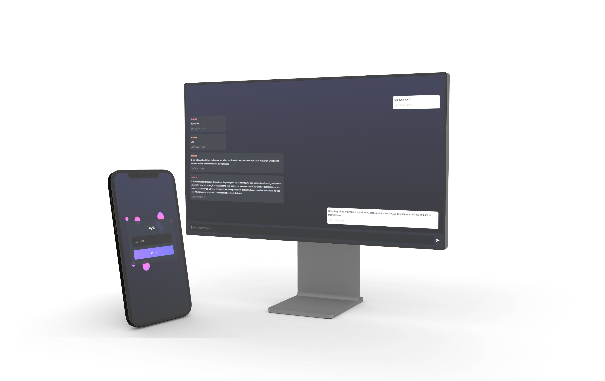

# Freechat

<p align="center">
  
</p>

Um chat de conversação projetado para facilitar conversas rápidas entre dois integrantes ou um grupo de pessoas com acesso ao link, feito a partir de estudos na internet para contribuir no início de aprendizado com Node.js, WebSocket e a comunicação em tempo real.

## Tecnologias Utilizadas

- Node.js
- WebSocket (ws)
- HTML
- CSS
- JavaScript

## Instalação

1. Clone este repositório.
   ```bash
   git clone https://github.com/vitoriaGoncalves08/freechat
2. Entre no diretório /backend e execute o comando:
   ```bash
   npm install
3. Após isso, execute o comando:
   ```bash
   npm start
4. Entre no diretório /frontend e abra com dois cliques o arquivo index.html.

## LINK 🚀

https://freechat-frontend.onrender.com

## Melhorias Futuras 🚧

- Autenticação de login
- Criação de salas de bate papo
- Envio de imagens
- Reações a mensagens
- Histórico de conversas
- Api rest backend com banco de dados

